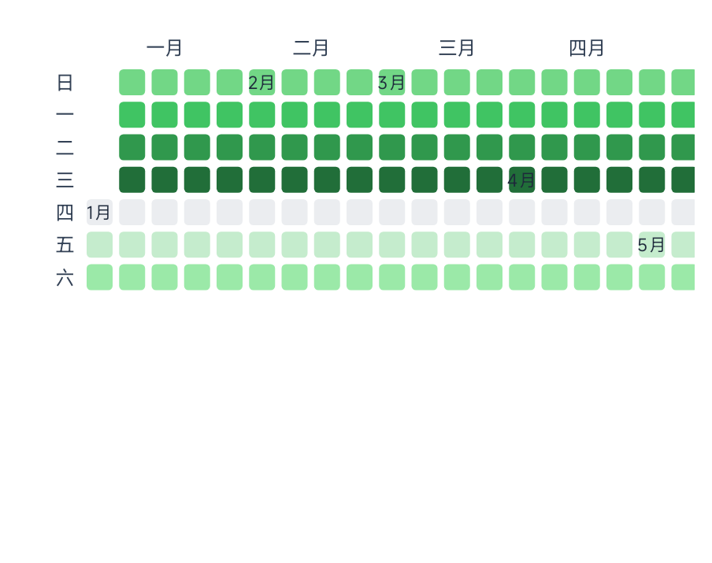
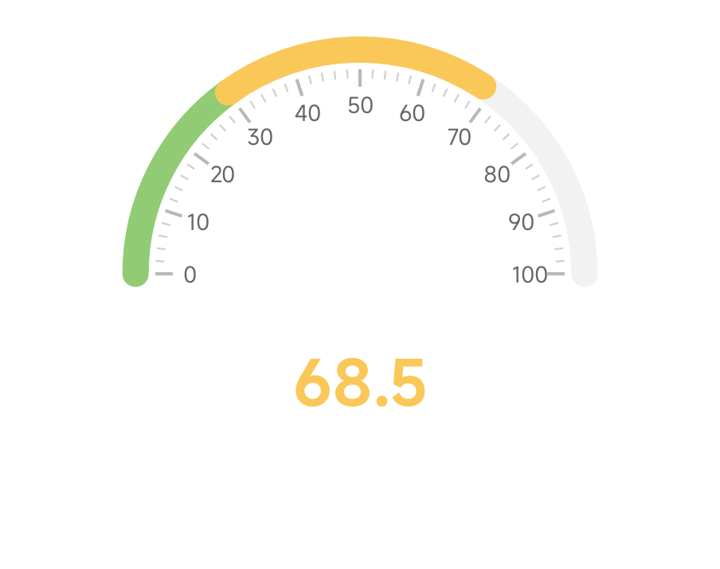
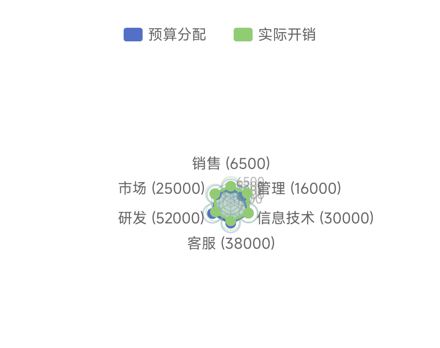
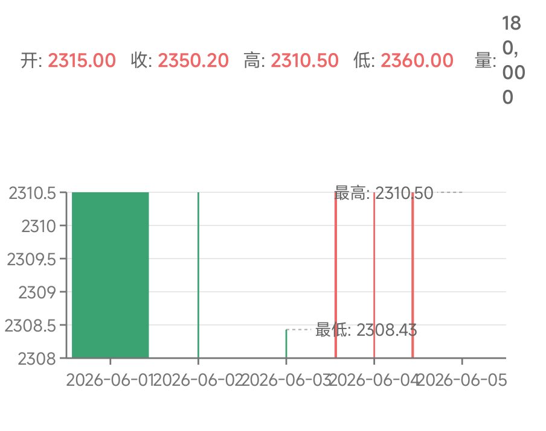
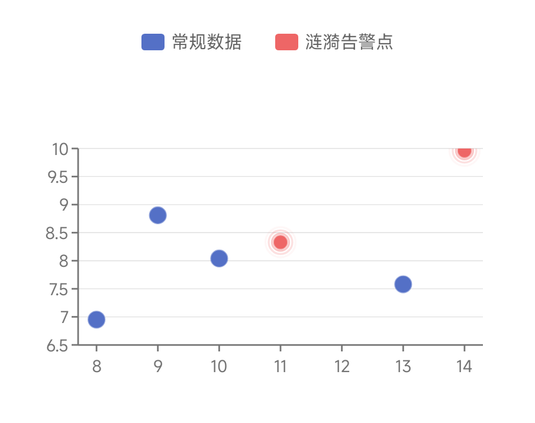
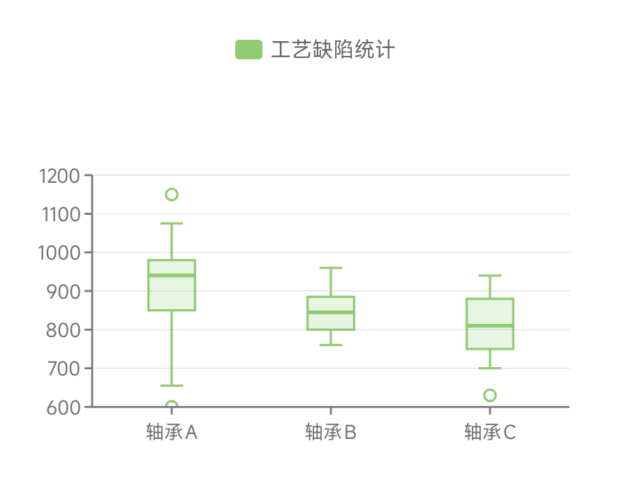
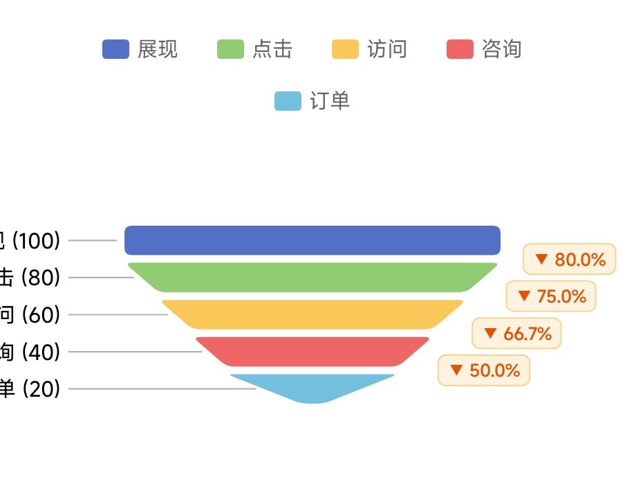
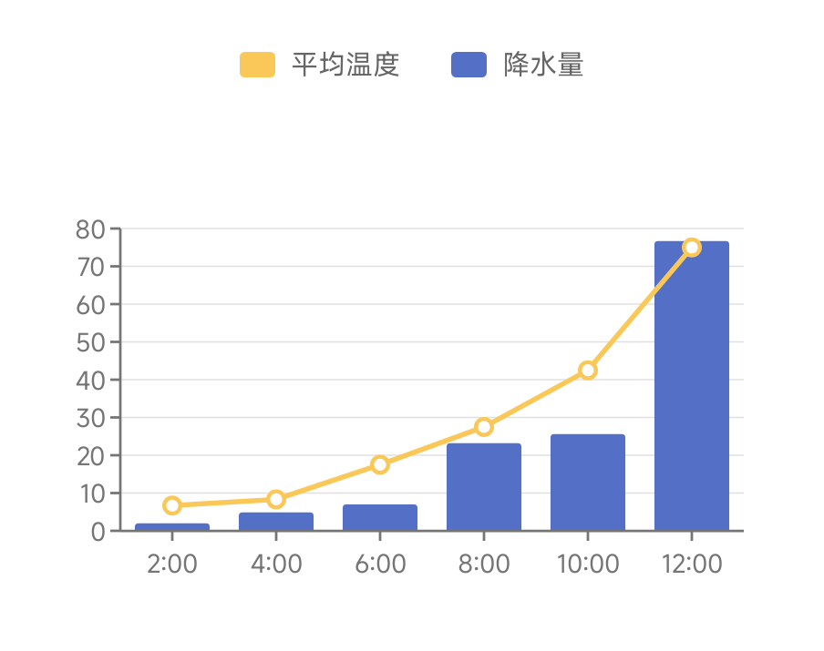
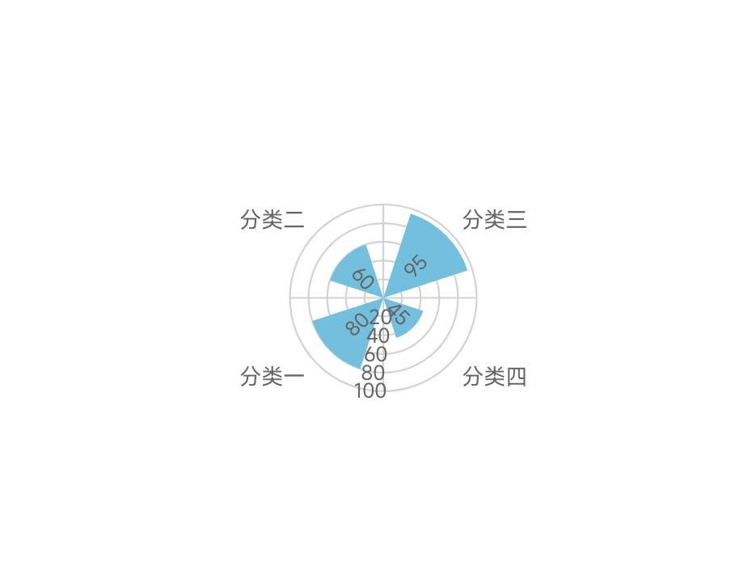

# AndroidComposeCharts 使用指南 (GUIDE.md)

本指南为您提供 `AndroidComposeCharts` 中全部 **13 大类原生图表组件**的快速接入示例与代码模板。所有示例的代码、数据及参数配置均与 App 演示大厅中的 **文档截图生成器** 完全一致，方便您直接复制到项目中使用，并可实时查阅其真实渲染效果图。

---

## 目录

1. [📈 折线图 (LineChart)](#1-折线图-linechart)
2. [📊 柱状图 (BarChart)](#2-柱状图-barchart)
3. [🍩 饼图/环形图/南丁格尔玫瑰图 (PieChart)](#3-饼图环形图南丁格尔玫瑰图-piechart)
4. [💎 3D 柱状打卡图 (Bar3DChart)](#4-3d-柱状打卡图-bar3dchart)
5. [📅 矩阵日历热力图 (CalendarChart)](#5-矩阵日历热力图-calendarchart)
6. [⏱️ 仪表盘 (GaugeChart)](#6-⏱️-仪表盘-gaugechart)
7. [🕸️ 战力对比雷达图 (RadarChart)](#7-战力对比雷达图-radarchart)
8. [🕯️ 金融个股日K线图 (KLineChart)](#8-🕯️-金融个股日k线图-klinechart)
9. [🔵 告警监控散点图/气泡图 (ScatterChart)](#9-告警监控散点图气泡图-scatterchart)
10. [📦 工艺缺陷箱线图 (BoxplotChart)](#10-工艺缺陷箱线图-boxplotchart)
11. [⏳ 流失转化漏斗图 (FunnelChart)](#11-流失转化漏斗图-funnelchart)
12. [🎛️ 雨量蒸发混合图 (MixedChart)](#12-雨量蒸发混合图-mixedchart)
13. [🌀 极坐标系扇形/圆环图 (PolarBarChart)](#13-极坐标系扇形圆环图-polarbarchart)

---

### 1. 📈 折线图 (LineChart)
折线图用于展示数据随时间或类目的连续变化趋势。支持平滑曲线、面积渐变、堆叠分组、双X/Y轴对比、置信区间带、警戒带及警戒线标注。

```kotlin
import androidx.compose.foundation.layout.fillMaxSize
import androidx.compose.runtime.Composable
import androidx.compose.ui.Modifier
import androidx.compose.ui.graphics.Brush
import androidx.compose.ui.graphics.Color
import io.github.composechart.charts.line.*
import io.github.composechart.core.style.ChartStyle

@Composable
fun LineChartDemo(style: ChartStyle) {
    // 1. 准备数据源
    val lineChartData = LineChartData(
        xLabels = listOf("周一", "周二", "周三", "周四", "周五", "周六", "周日"),
        series = listOf(
            LineSeries(
                name = "邮件营销",
                points = listOf(
                    LinePoint(0f, 120f), LinePoint(1f, 132f), LinePoint(2f, 101f),
                    LinePoint(3f, 134f), LinePoint(4f, 90f), LinePoint(5f, 230f), LinePoint(6f, 210f)
                ),
                color = Color(0xFF5470C6),
                isSmooth = true, // 平滑曲线
                drawArea = true, // 开启渐变面积填充
                areaBrush = Brush.verticalGradient(
                    colors = listOf(Color(0xFF5470C6).copy(alpha = 0.4f), Color.Transparent)
                )
            ),
            LineSeries(
                name = "联盟广告",
                points = listOf(
                    LinePoint(0f, 220f), LinePoint(1f, 182f), LinePoint(2f, 191f),
                    LinePoint(3f, 234f), LinePoint(4f, 290f), LinePoint(5f, 330f), LinePoint(6f, 310f)
                ),
                color = Color(0xFF91CC75),
                isSmooth = true
            )
        )
    )

    // 2. 渲染组件
    LineChart(
        data = lineChartData,
        style = style,
        modifier = Modifier.fillMaxSize()
    )
}
```

#### 效果图预览
| 亮色主题 (Light) | 暗色主题 (Dark) |
| :---: | :---: |
|  |  |

---

### 2. 📊 柱状图 (BarChart)
柱状图通过垂直条形高度对比数值大小。支持并列对比、正负双向堆叠、水平条形（旋转映射）和带槽背景。

```kotlin
import androidx.compose.foundation.layout.fillMaxSize
import androidx.compose.runtime.Composable
import androidx.compose.ui.Modifier
import androidx.compose.ui.geometry.CornerRadius
import androidx.compose.ui.graphics.Color
import io.github.composechart.charts.bar.*
import io.github.composechart.core.style.ChartStyle

@Composable
fun BarChartDemo(style: ChartStyle) {
    val barChartData = BarChartData(
        xLabels = listOf("一月", "二月", "三月", "四月", "五月", "六月"),
        series = listOf(
            BarSeries(
                name = "蒸发量",
                values = listOf(
                    BarValue(2.0f), BarValue(4.9f), BarValue(7.0f),
                    BarValue(23.2f), BarValue(25.6f), BarValue(76.7f)
                ),
                color = Color(0xFF5470C6),
                cornerRadius = CornerRadius(12f, 12f), // 顶部圆角半径
                barWidthRatio = 0.5f
            ),
            BarSeries(
                name = "降水量",
                values = listOf(
                    BarValue(2.6f), BarValue(5.9f), BarValue(9.0f),
                    BarValue(26.4f), BarValue(28.7f), BarValue(70.7f)
                ),
                color = Color(0xFF91CC75),
                cornerRadius = CornerRadius(12f, 12f),
                barWidthRatio = 0.5f
            )
        )
    )

    BarChart(
        data = barChartData,
        style = style,
        modifier = Modifier.fillMaxSize()
    )
}
```

#### 效果图预览
| 亮色主题 (Light) | 暗色主题 (Dark) |
| :---: | :---: |
|  |  |

---

### 3. 🍩 饼图/环形图/南丁格尔玫瑰图 (PieChart)
饼图展示分类占比。支持空心环形图、南丁格尔玫瑰图（角度等分、半径代表大小）、首尾半圆胶囊、扇区间隙及外部重叠引线标注。

```kotlin
import androidx.compose.foundation.layout.fillMaxSize
import androidx.compose.runtime.Composable
import androidx.compose.ui.Modifier
import androidx.compose.ui.graphics.Color
import androidx.compose.ui.unit.dp
import io.github.composechart.charts.pie.*
import io.github.composechart.core.style.ChartStyle

@Composable
fun PieChartDemo(style: ChartStyle) {
    val pieChartData = PieChartData(
        slices = listOf(
            PieSlice("搜索引擎", 1048f, Color(0xFF5470C6)),
            PieSlice("直接输入", 735f, Color(0xFF91CC75)),
            PieSlice("友情链接", 580f, Color(0xFFFAC858)),
            PieSlice("邮件营销", 484f, Color(0xFFEE6666))
        )
    )

    // 定制环形首尾圆角与扇区间隙
    val customStyle = style.copy(
        pieOptions = style.pieOptions.copy(
            innerRadiusRatio = 0.6f,   // 内径比例 (空心环)
            padAngle = 3f,             // 扇区分割间隙大小
            cornerRadius = 8.dp        // 首尾半圆胶囊圆角大小
        )
    )

    PieChart(
        data = pieChartData,
        style = customStyle,
        modifier = Modifier.fillMaxSize()
    )
}
```

#### 效果图预览
| 亮色主题 (Light) | 暗色主题 (Dark) |
| :---: | :---: |
|  |  |

---

### 4. 💎 3D 柱状打卡图 (Bar3DChart)
采用纯数学三维坐标变换与透视投影直绘，无需任何外部 3D 依赖。支持单指手势拖拽旋转（水平偏航 Yaw/垂直俯仰 Pitch）、双指捏合缩放（Zoom）以及发光选框交互。

```kotlin
import androidx.compose.foundation.layout.fillMaxSize
import androidx.compose.runtime.Composable
import androidx.compose.ui.Modifier
import androidx.compose.ui.graphics.Color
import io.github.composechart.charts.bar3d.*
import io.github.composechart.core.style.ChartStyle

@Composable
fun Bar3DChartDemo(style: ChartStyle) {
    val bar3DChartData = Bar3DChartData(
        xAxisLabels = listOf("12a", "1a", "2a", "3a", "4a", "5a", "6a"),
        yAxisLabels = listOf("周六", "周日"),
        points = listOf(
            Bar3DPoint(xIndex = 0, yIndex = 0, zValue = 5f),
            Bar3DPoint(xIndex = 2, yIndex = 0, zValue = 12f),
            Bar3DPoint(xIndex = 4, yIndex = 1, zValue = 8f),
            Bar3DPoint(xIndex = 6, yIndex = 1, zValue = 15f)
        )
    )

    val options = Bar3DOptions(
        initialYaw = -45f,
        initialPitch = 30f,
        initialZoom = 1.0f,
        barWidthRatio = 0.5f,
        // 依据高度热力渐变的色带
        visualMapColors = listOf(Color(0xFF73C0DE), Color(0xFF3BA272), Color(0xFFFAC858), Color(0xFFEE6666))
    )

    Bar3DChart(
        data = bar3DChartData,
        options = options,
        style = style,
        modifier = Modifier.fillMaxSize()
    )
}
```

#### 效果图预览
| 亮色主题 (Light) | 暗色主题 (Dark) |
| :---: | :---: |
|  |  |

---

### 5. 📅 矩阵日历热力图 (CalendarChart)
用于直观呈现全年打卡与数据分布。支持横向（GitHub 贡献墙列）、纵向排布，具备滑动视口防止被截断，并且在特定日期支持嵌入农历与特殊符号标签。

```kotlin
import androidx.compose.foundation.layout.fillMaxSize
import androidx.compose.runtime.Composable
import androidx.compose.ui.Modifier
import androidx.compose.ui.graphics.Color
import androidx.compose.ui.unit.dp
import io.github.composechart.charts.calendar.*
import io.github.composechart.core.style.ChartStyle
import java.time.LocalDate

@Composable
fun CalendarChartDemo(style: ChartStyle) {
    // 生成模拟的一整年规律打卡数据
    val calendarData = remember {
        val days = mutableListOf<CalendarDayData>()
        val start = LocalDate.of(2026, 1, 1)
        for (i in 0..364) {
            val date = start.plusDays(i.toLong())
            days.add(
                CalendarDayData(
                    date = date.toString(),
                    value = (i % 7 * 15).toFloat(), // 规律数据映射热力色阶
                    label = if (date.dayOfMonth == 1) "${date.monthValue}月" else null // 月份首日标注
                )
            )
        }
        CalendarChartData(year = 2026, days = days)
    }

    CalendarChart(
        data = calendarData,
        options = CalendarOptions(
            orientation = CalendarOrientation.Horizontal, // 横向布局
            cellSize = 12.dp,
            cellGap = 3.dp,
            visualMapColors = listOf(Color(0xFFEBEDF0), Color(0xFF9BE9A8), Color(0xFF40C463), Color(0xFF216E39))
        ),
        style = style,
        modifier = Modifier.fillMaxSize()
    )
}
```

#### 效果图预览
| 亮色主题 (Light) | 暗色主题 (Dark) |
| :---: | :---: |
|  |  |

---

### 6. ⏱️ 仪表盘 (GaugeChart)
经典仪表盘及等级分类表。支持进度色环弧模式、隐藏指针、StrokeCap.Round 胶囊端面及自定义指针形状。

```kotlin
import androidx.compose.foundation.layout.fillMaxSize
import androidx.compose.runtime.Composable
import androidx.compose.ui.Modifier
import androidx.compose.ui.graphics.Color
import io.github.composechart.charts.gauge.*
import io.github.composechart.core.style.ChartStyle

@Composable
fun GaugeChartDemo(style: ChartStyle) {
    val gaugeData = remember { GaugeChartData(value = 68.5f, min = 0f, max = 100f) }
    
    val customOptions = remember {
        GaugeOptions(
            startAngle = 180f,
            sweepAngle = 180f,
            isProgress = true,      // 开启纯进度弧模式 (首尾胶囊圆角)
            showPointer = false,    // 隐藏中心机械指针
            axisLineColors = listOf(
                0.3f to Color(0xFF91CC75),
                0.7f to Color(0xFFFAC858),
                1.0f to Color(0xFFEE6666)
            )
        )
    }

    GaugeChart(
        data = gaugeData,
        options = customOptions,
        style = style,
        modifier = Modifier.fillMaxSize()
    )
}
```

#### 效果图预览
| 亮色主题 (Light) | 暗色主题 (Dark) |
| :---: | :---: |
|  |  |

---

### 7. 🕸️ 战力对比雷达图 (RadarChart)
多维特征（指标）对比图。支持多边形/圆形网格、各系列自定义填充半透明色彩及单点 Tooltip 交互。

```kotlin
import androidx.compose.foundation.layout.fillMaxSize
import androidx.compose.runtime.Composable
import androidx.compose.ui.Modifier
import androidx.compose.ui.graphics.Color
import io.github.composechart.charts.radar.*
import io.github.composechart.core.style.ChartStyle

@Composable
fun RadarChartDemo(style: ChartStyle) {
    val radarData = RadarChartData(
        indicators = listOf(
            RadarIndicator("销售", 6500f),
            RadarIndicator("管理", 16000f),
            RadarIndicator("信息技术", 30000f),
            RadarIndicator("客服", 38000f),
            RadarIndicator("研发", 52000f),
            RadarIndicator("市场", 25000f)
        ),
        series = listOf(
            RadarSeries(
                name = "预算分配",
                values = listOf(4300f, 10000f, 28000f, 35000f, 50000f, 19000f),
                color = Color(0xFF5470C6)
            ),
            RadarSeries(
                name = "实际开销",
                values = listOf(5000f, 14000f, 28000f, 31000f, 42000f, 21000f),
                color = Color(0xFF91CC75)
            )
        )
    )

    RadarChart(
        data = radarData,
        style = style,
        modifier = Modifier.fillMaxSize()
    )
}
```

#### 效果图预览
| 亮色主题 (Light) | 暗色主题 (Dark) |
| :---: | :---: |
|  |  |

---

### 8. 🕯️ 金融个股日K线图 (KLineChart)
金融蜡烛图。支持开盘、最高、最低、收盘与下方成交量柱状图分栏物理联动，支持 MA5、MA10、MA20 三轨均线绘制。

```kotlin
import androidx.compose.foundation.layout.fillMaxSize
import androidx.compose.runtime.Composable
import androidx.compose.ui.Modifier
import io.github.composechart.charts.kline.*
import io.github.composechart.core.style.ChartStyle

@Composable
fun KLineChartDemo(style: ChartStyle) {
    val entries = listOf(
        KLineEntry("2026-06-01", 2320.26f, 2302.6f, 2287.3f, 2362.94f, 120000f),
        KLineEntry("2026-06-02", 2300f, 2291.3f, 2281.4f, 2311.68f, 85000f),
        KLineEntry("2026-06-03", 2293.09f, 2278.4f, 2272.24f, 2308.43f, 98000f),
        KLineEntry("2026-06-04", 2280f, 2314.9f, 2273.4f, 2320.1f, 140000f),
        KLineEntry("2026-06-05", 2315f, 2350.2f, 2310.5f, 2360f, 180000f)
    )
    val kLineData = KLineChartData(entries = entries)

    KLineChart(
        data = kLineData,
        style = style,
        modifier = Modifier.fillMaxSize()
    )
}
```

#### 效果图预览
| 亮色主题 (Light) | 暗色主题 (Dark) |
| :---: | :---: |
|  |  |

---

### 9. 🔵 告警监控散点图/气泡图 (ScatterChart)
散点气泡图。支持将点映射到类目轴或数值双轴，支持 VisualMap（第三维度数据映射散点的大小和颜色深浅），支持涟漪动画扩散效果（用于故障点特效告警）。

```kotlin
import androidx.compose.foundation.layout.fillMaxSize
import androidx.compose.runtime.Composable
import androidx.compose.ui.Modifier
import androidx.compose.ui.graphics.Color
import androidx.compose.ui.unit.dp
import io.github.composechart.charts.scatter.*
import io.github.composechart.core.style.ChartStyle

@Composable
fun ScatterChartDemo(style: ChartStyle) {
    val scatterData = ScatterChartData(
        series = listOf(
            ScatterSeries(
                name = "常规数据",
                points = listOf(
                    ScatterPoint(10f, 8.04f), ScatterPoint(8.0f, 6.95f),
                    ScatterPoint(13f, 7.58f), ScatterPoint(9.0f, 8.81f)
                ),
                color = Color(0xFF5470C6),
                symbolSize = 10.dp
            ),
            ScatterSeries(
                name = "涟漪告警点",
                points = listOf(
                    ScatterPoint(11f, 8.33f), ScatterPoint(14f, 9.96f)
                ),
                color = Color(0xFFEE6666),
                effectScatter = true, // 开启呼吸外扩涟漪
                effectOptions = EffectOptions(rippleCount = 3, rippleRadiusRatio = 2.5f)
            )
        )
    )

    ScatterChart(
        data = scatterData,
        style = style,
        modifier = Modifier.fillMaxSize()
    )
}
```

#### 效果图预览
| 亮色主题 (Light) | 暗色主题 (Dark) |
| :---: | :---: |
|  |  |

---

### 10. 📦 工艺缺陷箱线图 (BoxplotChart)
箱线图（又称盒须图）用于展示一组数据的分布区间。自动绘制最大值、上四分位数、中位数、下四分位数、最小值及单独绘制异常离群点。

```kotlin
import androidx.compose.foundation.layout.fillMaxSize
import androidx.compose.runtime.Composable
import androidx.compose.ui.Modifier
import androidx.compose.ui.graphics.Color
import io.github.composechart.charts.boxplot.*
import io.github.composechart.core.style.ChartStyle

@Composable
fun BoxplotChartDemo(style: ChartStyle) {
    val boxplotData = BoxplotChartData(
        xLabels = listOf("轴承A", "轴承B", "轴承C"),
        series = listOf(
            BoxplotSeries(
                name = "工艺缺陷统计",
                points = listOf(
                    BoxplotPoint(655f, 850f, 940f, 980f, 1075f),
                    BoxplotPoint(760f, 800f, 845f, 885f, 960f),
                    BoxplotPoint(700f, 750f, 810f, 880f, 940f)
                ),
                color = Color(0xFF91CC75),
                outliers = listOf(
                    BoxplotOutlier(xIndex = 0, value = 600f),
                    BoxplotOutlier(xIndex = 0, value = 1150f),
                    BoxplotOutlier(xIndex = 2, value = 630f)
                )
            )
        )
    )

    BoxplotChart(
        data = boxplotData,
        style = style,
        modifier = Modifier.fillMaxSize()
    )
}
```

#### 效果图预览
| 亮色主题 (Light) | 暗色主题 (Dark) |
| :---: | :---: |
|  |  |

---

### 11. ⏳ 流失转化漏斗图 (FunnelChart)
漏斗图用于展示流失转化流程。支持倒置金字塔与标准漏斗切换、支持系列间转化差率百分比标注及高低色带映射。

```kotlin
import androidx.compose.foundation.layout.fillMaxSize
import androidx.compose.runtime.Composable
import androidx.compose.ui.Modifier
import androidx.compose.ui.graphics.Color
import io.github.composechart.charts.funnel.*
import io.github.composechart.core.style.ChartStyle

@Composable
fun FunnelChartDemo(style: ChartStyle) {
    val funnelData = FunnelChartData(
        slices = listOf(
            FunnelSlice("展现", 100f, Color(0xFF5470C6)),
            FunnelSlice("点击", 80f, Color(0xFF91CC75)),
            FunnelSlice("访问", 60f, Color(0xFFFAC858)),
            FunnelSlice("咨询", 40f, Color(0xFFEE6666)),
            FunnelSlice("订单", 20f, Color(0xFF73C0DE))
        )
    )

    FunnelChart(
        data = funnelData,
        style = style,
        modifier = Modifier.fillMaxSize()
    )
}
```

#### 效果图预览
| 亮色主题 (Light) | 暗色主题 (Dark) |
| :---: | :---: |
|  |  |

---

### 12. 🎛️ 雨量蒸发混合图 (MixedChart)
混合图允许折线图与柱状图在同一画布中绘制。支持左右双 Y 轴重合对齐且共享统一的交互 Tooltip。

```kotlin
import androidx.compose.foundation.layout.fillMaxSize
import androidx.compose.runtime.Composable
import androidx.compose.ui.Modifier
import androidx.compose.ui.graphics.Color
import io.github.composechart.charts.bar.BarSeries
import io.github.composechart.charts.bar.BarValue
import io.github.composechart.charts.line.LinePoint
import io.github.composechart.charts.line.LineSeries
import io.github.composechart.charts.mixed.*
import io.github.composechart.core.style.ChartStyle

@Composable
fun MixedChartDemo(style: ChartStyle) {
    val mixedData = MixedChartData(
        xLabels = listOf("2:00", "4:00", "6:00", "8:00", "10:00", "12:00"),
        // 绑定到左 Y 轴的柱状图数据
        barSeries = listOf(
            BarSeries(
                name = "降水量",
                values = listOf(BarValue(2.0f), BarValue(4.9f), BarValue(7.0f), BarValue(23.2f), BarValue(25.6f), BarValue(76.7f)),
                color = Color(0xFF5470C6),
                yAxisIndex = 0
            )
        ),
        // 绑定到右 Y 轴的折线图数据
        lineSeries = listOf(
            LineSeries(
                name = "平均温度",
                points = listOf(LinePoint(0f, 2.0f), LinePoint(1f, 2.2f), LinePoint(2f, 3.3f), LinePoint(3f, 4.5f), LinePoint(4f, 6.3f), LinePoint(5f, 10.2f)),
                color = Color(0xFFFAC858),
                yAxisIndex = 1
            )
        )
    )

    MixedChart(
        data = mixedData,
        style = style,
        modifier = Modifier.fillMaxSize()
    )
}
```

#### 效果图预览
| 亮色主题 (Light) | 暗色主题 (Dark) |
| :---: | :---: |
|  |  |

---

### 13. 🌀 极坐标系扇形/圆环图 (PolarBarChart)
在极坐标网格中渲染柱体。支持径向排版标签的“极坐标径向图”以及同心多层轨道的“极坐标切向圆环图”。

```kotlin
import androidx.compose.foundation.layout.fillMaxSize
import androidx.compose.runtime.Composable
import androidx.compose.ui.Modifier
import androidx.compose.ui.graphics.Color
import io.github.composechart.charts.polar.*
import io.github.composechart.core.style.ChartStyle

@Composable
fun PolarBarChartDemo(style: ChartStyle) {
    val polarData = PolarChartData(
        xLabels = listOf("分类一", "分类二", "分类三", "分类四"),
        series = listOf(
            PolarBarSeries(
                name = "系列A",
                values = listOf(80f, 60f, 95f, 45f).map { PolarBarValue(it) },
                color = Color(0xFF73C0DE)
            )
        )
    )

    PolarBarChart(
        data = polarData,
        style = style,
        modifier = Modifier.fillMaxSize()
    )
}
```

#### 效果图预览
| 亮色主题 (Light) | 暗色主题 (Dark) |
| :---: | :---: |
|  |  |
